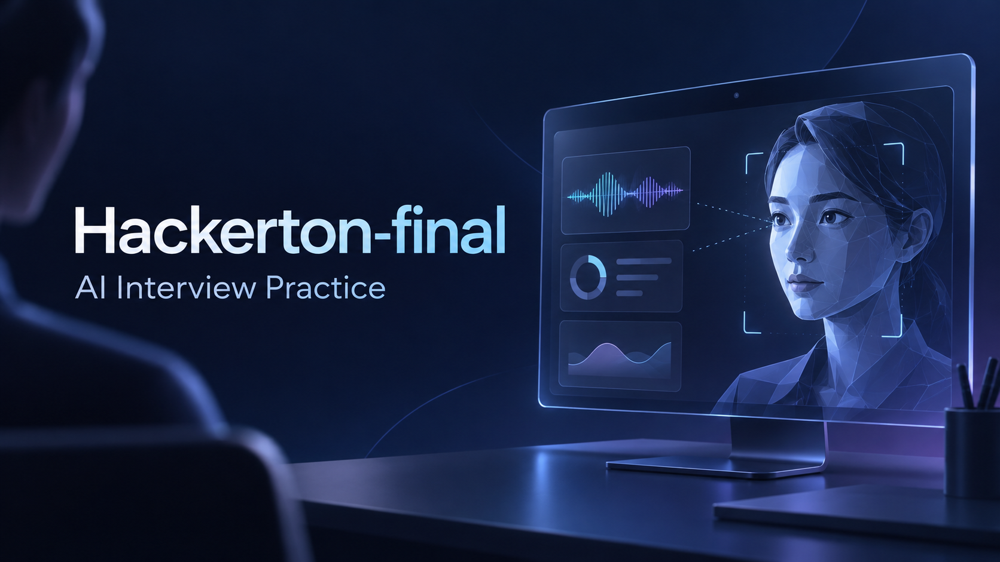
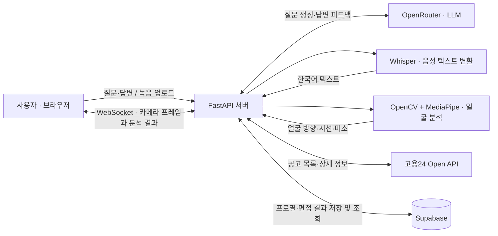

<p align="center">
  
</p>

<h1 align="center">Hackerton-final · AI 모의면접</h1>

<p align="center">
  <strong>답변의 내용과 전달 방식을 함께 연습하는 AI 모의면접 웹 서비스</strong><br />
  AI 질문 생성 · 음성 답변 변환 · 실시간 시선·표정 피드백
</p>

<p align="center">
  
  
  
  
  
</p>

<p align="center">
  <a href="#주요-기능">주요 기능</a> ·
  <a href="#사용-흐름">사용 흐름</a> ·
  <a href="#시스템-구조">시스템 구조</a> ·
  <a href="#실행-방법">실행 방법</a> ·
  <a href="#관련-저장소">관련 저장소</a>
</p>

<p align="center"><sub>상단 이미지는 프로젝트의 기능을 표현한 AI 생성 컨셉 일러스트입니다.</sub></p>

## 프로젝트 소개

혼자 면접을 준비할 때는 답변을 어떻게 구성할지뿐 아니라, 말하는 동안 시선과 표정이 어떻게 보이는지도 확인하기 어렵습니다. **Hackerton-final**은 질문에 답하고, 답변에 대한 피드백과 영상 분석 결과를 함께 확인할 수 있도록 만든 해커톤 협업 프로젝트입니다.

브라우저에서 면접을 진행하면 AI가 이전 답변을 바탕으로 다음 질문을 생성합니다. 면접 중에는 카메라로 얼굴 방향·시선·미소를 살펴보고, 종료 후에는 답변의 강점·개선점·제안을 확인할 수 있습니다. 채용공고 검색과 면접 기록 저장 기능도 함께 구성했습니다.

| 항목 | 내용 |
| --- | --- |
| 프로젝트 형태 | 2025년 해커톤 협업 웹 프로젝트 |
| 핵심 경험 | 5개 질문으로 구성된 AI 모의면접과 영상 기반 피드백 |
| 구성 | FastAPI 백엔드 + Jinja2 템플릿 + 브라우저 JavaScript |
| 개발 범위 | AI 질의응답, 음성·영상 처리, 채용공고 연동, 결과 저장·조회 |

## 주요 기능

| 기능 | 구현 내용 |
| --- | --- |
| **AI 면접 질문** | OpenRouter를 통해 질문을 생성하고, 이전 질문·답변을 다음 질문의 맥락으로 전달합니다. 채용공고에서 면접을 시작하면 회사명과 공고 제목을 활용합니다. |
| **음성·텍스트 답변** | 마이크로 답변을 녹음하고, 녹음 종료 후 Whisper로 한국어 텍스트를 추출합니다. 화면에서 답변 텍스트를 직접 수정할 수 있습니다. |
| **실시간 영상 피드백** | 카메라 프레임을 1초 간격으로 전송해 얼굴 방향, 좌·우·중앙 시선, 미소 지표를 표시합니다. |
| **면접 결과** | 5개 답변을 바탕으로 강점·개선점·제안을 생성하고, 영상 분석의 항목별 점수와 함께 보여줍니다. |
| **채용공고 연동** | 고용24 Open API로 공고를 검색하고, 상세 정보를 확인한 뒤 해당 공고로 면접을 시작할 수 있습니다. |
| **기록 저장·조회** | 이메일과 결과 데이터를 Supabase에 저장하고, 이메일로 이전 면접 기록 목록을 조회합니다. |

## 사용 흐름

1. **면접 준비** — 직무·회사 정보를 입력하거나, 채용공고 목록에서 지원할 공고를 선택합니다.
2. **장치 연결** — 면접 화면에서 카메라와 마이크 접근을 허용합니다.
3. **질문에 답변** — AI가 생성한 질문에 음성 또는 텍스트로 답변합니다. 녹음한 경우 변환된 텍스트를 확인한 뒤 다음 질문으로 진행합니다.
4. **전달 방식 확인** — 면접 중 얼굴 방향·시선·미소 지표를 확인합니다.
5. **피드백 확인** — 5개 질문을 마치면 답변 피드백과 영상 분석 결과를 살펴봅니다.
6. **기록 남기기** — 이메일을 입력해 결과를 저장하고, 면접 기록 화면에서 목록을 조회합니다.

질문은 **자기소개 → 지원 동기 → 직무 역량·경험 → 문제해결·갈등 상황 → 성장 포부** 순서로 진행하도록 프롬프트를 구성했습니다.

## 시스템 구조



### 기술 스택

| 영역 | 기술 | 역할 |
| --- | --- | --- |
| 화면 | HTML, CSS, Bootstrap, JavaScript, Jinja2 | 면접·공고·결과 화면과 브라우저 상태 관리 |
| API 서버 | Python, FastAPI, Uvicorn, Pydantic | 페이지 제공, 요청 검증, API 라우팅 |
| 질문·피드백 | OpenRouter (`anthropic/claude-3-haiku`) | 면접 질문과 답변에 대한 텍스트 피드백 생성 |
| 음성 처리 | Whisper `small`, FFmpeg, Pydub, Librosa | 녹음 변환, 한국어 STT, 음성 신호 특징 추출 |
| 영상 처리 | MediaPipe FaceMesh, OpenCV, NumPy, WebSocket | 얼굴·홍채 랜드마크 기반 분석과 결과 전달 |
| 데이터 저장 | Supabase REST API | 프로필, 면접 입력 데이터, 결과 기록 저장 |
| 외부 데이터 | 고용24 Open API, HTTPX, xmltodict | 채용공고 조회와 XML 응답 가공 |
| 컨테이너 구성 | Docker, Docker Compose | Python 3.10 기반 실행 환경 정의 |

### 구현 포인트

- **답변 맥락을 이어가는 면접**: [interview.js](static/js/interview.js)에서 이전 질문·답변을 모아 다음 질문과 최종 피드백의 입력으로 사용합니다.
- **음성과 영상의 처리 경로 분리**: 녹음은 HTTP 업로드 후 [voice.py](server/voice.py)에서 16kHz 모노 오디오로 변환해 분석하고, 영상은 [camera_analyzer.py](server/camera_analyzer.py)의 WebSocket으로 전달합니다.
- **영상 전송량 조절**: [camera_ai.js](static/js/camera_ai.js)는 480×360 JPEG 프레임을 1초마다 전송합니다. 서버는 얼굴 랜드마크 분석 결과를 JSON으로 돌려줍니다.
- **채용공고 데이터 가공**: [work24.py](api/routers/work24.py)에서 XML 응답을 화면용 데이터로 변환합니다. 근무지 상세 조회는 최대 6개 요청을 병렬 처리하고, 결과를 24시간 동안 메모리에 캐시합니다.

### 영상 점수 계산

최종 영상 점수는 면접 중 수집한 각 지표의 평균으로 계산합니다.

```text
최종 영상 점수 = 얼굴 방향 평균 × 0.30
               + 시선 평균 × 0.40
               + 미소 평균 × 0.30
```

얼굴 방향은 정면 여부, 시선은 중앙 여부, 미소는 입 주변 랜드마크의 비율을 기준으로 계산합니다. 이 점수는 **면접 연습을 위한 전달 방식 관찰 지표**이며, 답변 내용에 대한 강점·개선점은 LLM의 텍스트 피드백으로 제공합니다.

## 프로젝트 구조

```text
Hackerton-final/
├── app.py                    # FastAPI 앱, 페이지와 API 라우터 등록
├── server/
│   ├── interview.py          # OpenRouter 텍스트 생성
│   ├── voice.py              # 녹음 변환·Whisper STT
│   ├── camera_analyzer.py    # WebSocket·얼굴 랜드마크 분석
│   ├── profile.py            # 프로필 저장
│   ├── user_input.py         # 면접 입력·DOCX 처리 API
│   ├── result_save.py        # 면접 결과 저장
│   └── result_load.py        # 면접 기록 조회
├── api/routers/work24.py     # 고용24 채용공고 API 연동
├── templates/               # Jinja2 페이지 템플릿
├── static/                  # JavaScript, CSS, 이미지
├── docs/assets/             # README 대표 이미지
├── .env.example             # 환경변수 예시
├── requirements.txt         # Python 의존성
├── Dockerfile
└── docker-compose.yml
```

## 실행 방법

### 1. 실행 환경 준비

- Python 3.10 — 저장소의 Dockerfile 기준
- FFmpeg — 설치 후 `ffmpeg -version`으로 PATH 등록 확인
- 카메라·마이크를 사용할 수 있는 브라우저
- OpenRouter API 키와 Supabase 프로젝트
- 채용공고 기능을 사용할 경우 고용24 Open API 키

프런트엔드는 서버가 제공하는 정적 파일을 사용하므로 별도의 npm 빌드 과정은 없습니다.

### 2. 저장소와 가상환경 준비

```bash
git clone https://github.com/han122400/Hackerton-final.git
cd Hackerton-final
python -m venv .venv
```

Windows PowerShell:

```powershell
.\.venv\Scripts\Activate.ps1
python -m pip install -r requirements.txt
Copy-Item .env.example .env
```

macOS / Linux:

```bash
source .venv/bin/activate
python -m pip install -r requirements.txt
cp .env.example .env
```

### 3. 환경변수와 데이터베이스 설정

`.env`에 아래 값을 설정합니다. 실제 키는 로컬 환경에서 관리합니다.

```dotenv
OPENROUTER_API_KEY=your_openrouter_api_key
SUPABASE_URL=https://your-project.supabase.co
SUPABASE_SERVICE_ROLE_KEY=your_service_role_key
WORK24_KEY=your_work24_api_key
```

`SUPABASE_URL`과 `SUPABASE_SERVICE_ROLE_KEY`는 서버 초기화 시 필요합니다. `WORK24_KEY`는 채용공고 기능에 사용합니다. `.env.example`의 `TYPECAST_API_KEY`와 `JWT_SECRET`은 현재 주요 실행 코드에서 사용하지 않습니다.

Supabase에는 다음 테이블이 필요합니다. 아래는 **API에서 사용하는 필드 목록**이며, 저장소에는 테이블 생성용 마이그레이션이 포함되어 있지 않습니다.

| 테이블 | 코드에서 사용하는 필드 |
| --- | --- |
| `profiles` | `name`, `email`, `phone`, `education`, `experience` |
| `interviews` | `user_name`, `position`, `company`, `notes`, `start_time`, `analysis` |
| `results_log` | `id`, `email`, `created_at`, `result` |

`analysis`와 `result`는 JSON 데이터를 저장합니다. 결과 저장 요청은 `email`과 `result`를 전달하므로, `results_log`의 `id`와 `created_at`에는 자동 생성 기본값을 설정해야 합니다. Service Role 키는 서버의 환경변수로만 관리합니다.

### 4. 서버 실행

```bash
python -m uvicorn app:app --reload --host 127.0.0.1 --port 8000
```

- 서비스: [http://127.0.0.1:8000](http://127.0.0.1:8000)
- API 문서: [http://127.0.0.1:8000/docs](http://127.0.0.1:8000/docs)
- 상태 확인: [http://127.0.0.1:8000/health](http://127.0.0.1:8000/health)

Whisper 모델은 첫 음성 분석 시 다운로드·로딩되어 초기 응답에 시간이 걸릴 수 있습니다. 카메라·마이크는 로컬호스트 또는 HTTPS 환경에서 접근 권한을 허용한 뒤 사용합니다.

### 주요 API

| 방식 | 경로 | 기능 |
| --- | --- | --- |
| `POST` | `/api/generate-text` | AI 질문·피드백 생성 |
| `POST` | `/api/analyze` | 녹음 파일 분석·한국어 STT |
| `WebSocket` | `/api/ws` | 카메라 프레임 분석 |
| `GET` | `/api/jobs` | 채용공고 목록 조회 |
| `GET` | `/api/jobs/{emp_seqno}` | 채용공고 상세 조회 |
| `POST` | `/api/profile` | 프로필 저장 |
| `POST` | `/api/result_save` | 면접 결과 저장 |
| `GET` | `/api/result_load` | 면접 기록 목록 조회 |

## 현재 구현 범위와 개선 과제

해커톤에서 구현한 프로토타입을 기준으로 소개합니다.

- **개인화 입력 연결**: 채용공고의 회사·제목과 이전 답변을 질문에 활용합니다. 직접 입력 화면과 면접 화면의 일부 필드명 연결은 추가 정리가 필요합니다.
- **DOCX 처리**: 서버에는 본문·표 추출 API가 있으나, 현재 면접 준비 화면의 파일 선택은 파일명만 사용합니다. 업로드부터 질문 반영까지의 연결은 후속 과제입니다.
- **결과 데이터**: 면접 완료 결과는 브라우저에 저장한 데이터를 사용합니다. `/api/result`와 일부 누락값 처리에는 시연용 기본 데이터가 포함되어 있습니다.
- **영상 지표 검증**: 얼굴 방향·시선·미소는 랜드마크 기반 휴리스틱으로 계산합니다. 조명, 카메라 위치, 얼굴 검출 실패에 따른 영향과 점수 기준을 개선할 여지가 있습니다.

## 관련 저장소

| 저장소 | 내용 |
| --- | --- |
| **[Hackerton-final](https://github.com/han122400/Hackerton-final)** | 면접 화면, API, 음성·영상 분석과 결과 저장을 통합한 최종 협업 저장소 |
| [Hackerton-cameraAI](https://github.com/han122400/Hackerton-cameraAI) | 얼굴 방향·시선·표정 분석과 점수화 실험 |
| [Hackerton-test-ai](https://github.com/han122400/Hackerton-test-ai) | OpenRouter·Typecast API 연동 실험 |
| [Hackerton-test-camera](https://github.com/han122400/Hackerton-test-camera) | 영상 분석 기능 테스트 |
